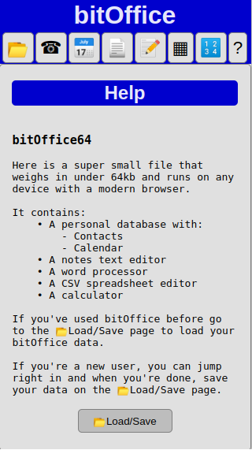
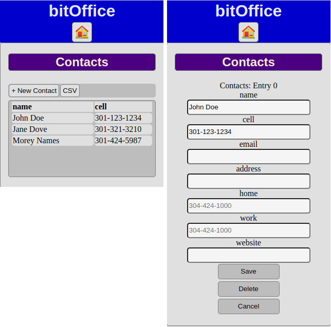
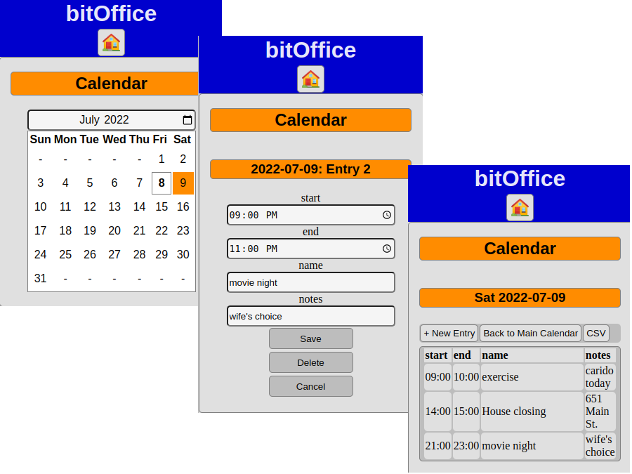
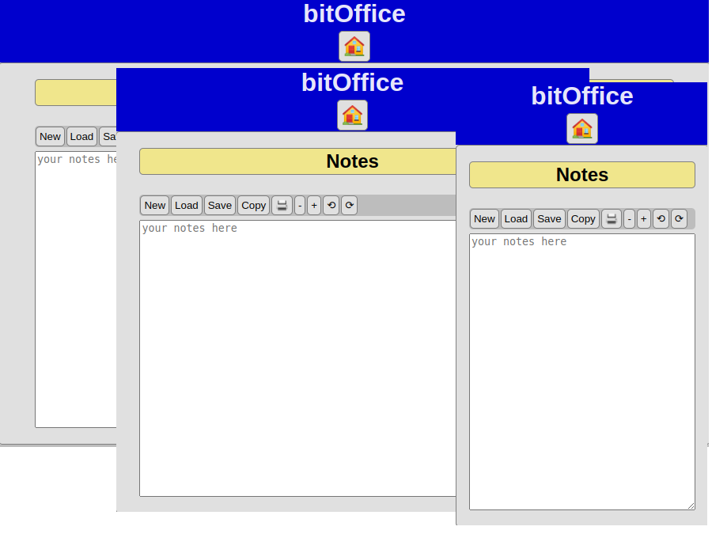
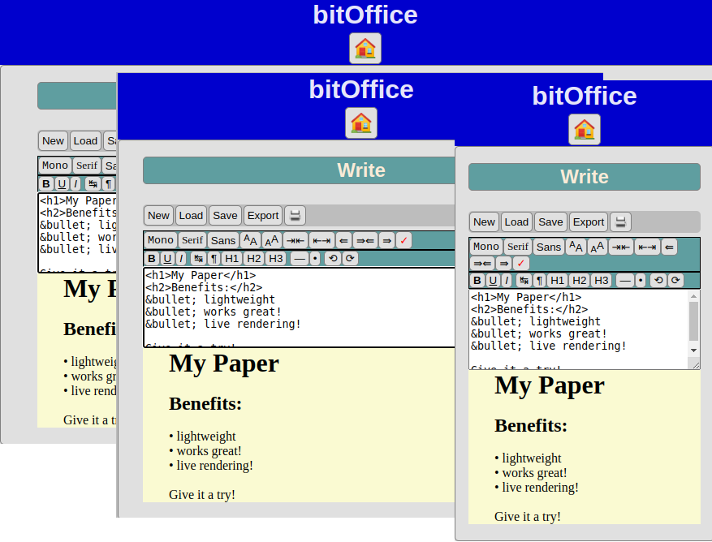
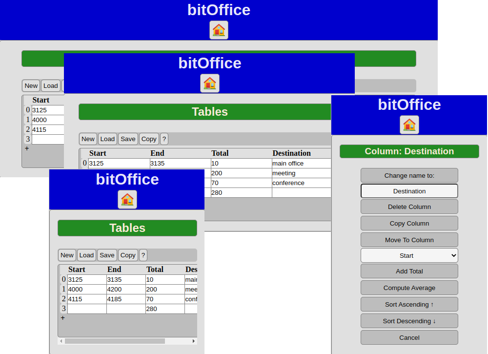
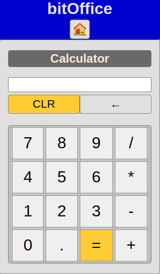

# bitOffice64

## A suite of cross-platform office apps weighing in under 64kb.

### It contains:

* A personal database with Contacts and Calendar
* A text editor (Notes)
* A word processor (Write) 
* A CSV spreadsheet editor (Tables)
* A calculator

## To download the suite, simply download the index.html file.  It is a single file and will open in any modern browser.  That's it.

### Alternatively, copy the raw contents of index.html file available on this page and save it to yourName.html. 
 Generally this file will be usable on any machine with a modern browser like a phone, a laptop, or a desktop machine.

10/4/2023, updated ical format to be compatible with outlook
